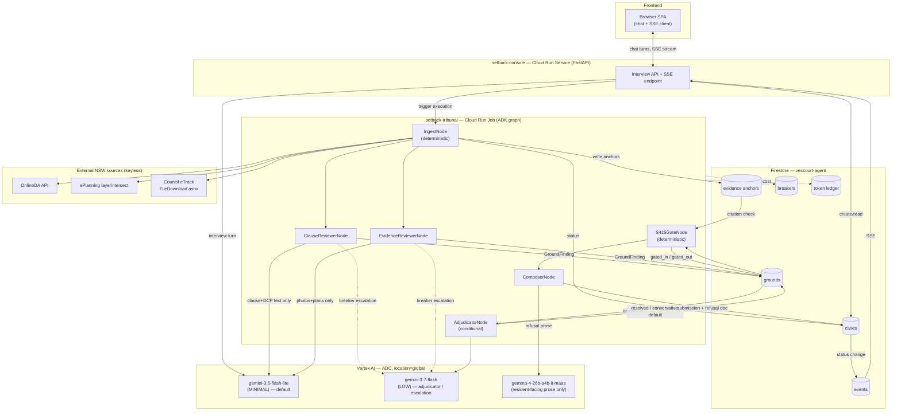

# Setback

A Collaborative Partner agent that helps NSW residents object to a
neighbouring Development Application (DA).

Built for the Google "All Things Agentic Hackathon".

## What it is

Setback interviews a resident about their concerns with a neighbouring DA,
ingests the exhibited plans and any photos the resident supplies, verifies
every factual claim against keyless NSW government zoning and planning APIs,
and runs two structurally disjoint reviewer agents plus an adjudication step
over each candidate objection ground. A deterministic citation gate then
checks every surviving ground for a resolvable source before anything is
allowed to ship. Grounds that are not planning-relevant under EP&A Act s4.15
are refused, with a plain-language explanation of why, rather than silently
dropped. The output is a submission that cites only grounds that survived
the whole pipeline.

## Architecture



Solid arrows are the main data path; dashed arrows are escalation/observability
side channels (breaker upgrades, ledger writes). See
[docs/ARCHITECTURE.md](./docs/ARCHITECTURE.md) for the full write-up (component
map, Firestore schema, failure handling, credential security, the s4.15 gate,
and the MVP cut list) — this diagram is its §9, reproduced here.

At a high level: Interview -> Ingest (OnlineDA + ePlanning spatial + council
tracker) -> Evidence dossier -> Court (Clause Reviewer / Evidence Reviewer /
adjudication bench) -> Citation gate -> Dispatch (submission + refusal
explainer).

## Local spin-up

For judges: the 5-minute walkthrough is in [TESTING.md](./TESTING.md).

```sh
uv sync
cp .env.example .env   # fill in local overrides; see setback/config.py for defaults
make test
make run-local
```

`make test` runs the full offline suite (691 tests) and `make run-local`
serves the console UI on `localhost:8000` with no network calls — both work
with no GCP project at all, and are enough to read the code, run the tests,
and click through the UI.

What this does **not** give you is a working tribunal: the console always
constructs its Firestore/GCS/Vertex clients against a real GCP project (there
is no emulator or offline mode for those). To run an actual end-to-end case —
interview through to a submission — you need your own GCP project with:

- APIs enabled: `run.googleapis.com`, `artifactregistry.googleapis.com`,
  `cloudbuild.googleapis.com`, `firestore.googleapis.com`,
  `secretmanager.googleapis.com`, `aiplatform.googleapis.com`
- A Firestore database and a GCS bucket for uploaded evidence
- Application Default Credentials for that project (`gcloud auth
  application-default login`)
- The environment variables in [`.env.example`](./.env.example) —
  `SETBACK_GCP_PROJECT`, `SETBACK_FIRESTORE_DB`, `SETBACK_REGION`,
  `SETBACK_GCS_BUCKET`, `SETBACK_GCS_UPLOADS_BUCKET` — pointed at that project

The author's own deployment (`vexcourt-agent`, used for the demo video and
hosted URL) is not available for judges to use directly; the steps above
recreate it against a project you control.

## Cloud spin-up

```sh
gcloud auth login
gcloud auth application-default login
export SETBACK_GCP_PROJECT=your-gcp-project-id   # a project you own
./deploy.sh
# or: make deploy
```

`deploy.sh` is idempotent: it enables the required APIs, creates the
Artifact Registry repo (once), builds and pushes the image via Cloud Build,
and deploys two Cloud Run deployables —

- `setback-console` (Cloud Run **Service**): the resident-facing FastAPI
  console, `min-instances=0`, public, session-affinity enabled.
- `setback-tribunal` (Cloud Run **Job**): the ADK court-graph pipeline, 1
  vCPU / 2GiB, 1800s task timeout, invocable only by the console's service
  account.

Expected output ends with something like:

```
>> Deploy complete.
image:             australia-southeast1-docker.pkg.dev/<project>/setback/setback:<tag>
console URL:       https://setback-console-xxxxxxxxxx-ts.a.run.app
console revision:  setback-console-00042-abc
tribunal job:      setback-tribunal (generation 7)
```

See [`deploy.sh`](./deploy.sh) for the full commented sequence (API
enablement, IAM bindings, cleanup policy) and
[docs/ARCHITECTURE.md §5](./docs/ARCHITECTURE.md) for the credential-security
model behind the two service accounts it deploys as.

## Public demo protection

The live URL above is genuinely public — no signup, no login — because judges need to
just click it and try a case. That also means it's open to anyone else on the internet,
so the console carries a layered abuse guard, on top of (not instead of) the existing
hourly per-IP case-creation limiter.

Every anonymous visitor gets capped per calendar day: 5 new cases, 30 interview turns per
case, 5 uploads per case, 10 refusal-feedback submissions per case. These caps key off a
salted SHA-256 hash of the caller's IP, never the raw address itself — no visitor IP is
ever stored anywhere (see `console.guards.hashed_client_id`).

Underneath that sits one global switch: a running public-spend ceiling
(`PUBLIC_SPEND_CEILING_USD`, defaulting to $26 USD — about AUD$40, the founder's own
number) plus two hard count backstops (5,000 anonymous cases, 100,000 anonymous interview
turns, in case a cheap-request loop somehow outruns the dollar figure first). Cross it and
new anonymous *mutations* — creating a case, an interview turn, an upload, starting a
tribunal run — get a plain 429 with an honest message. Every existing case stays fully
readable, and the read side of the app never blocks: nobody's work disappears because the
budget ran out.

One session bypasses all of it: opening `/docket` with the correct key (the same key that
already gates the docket board) sets a signed cookie, and any request carrying it skips
every limit above. That's the intended judge/founder path once the public ceiling is hit —
not documented anywhere on the public-facing pages themselves, just here and in
[docs/DESIGN-DECISIONS.md](./docs/DESIGN-DECISIONS.md).

**One caveat worth knowing before rotating the docket key**: the key doubles as the salt
for the per-client daily counters, so rotating it (say, after a suspected leak) does two
things at once — it invalidates every privileged cookie issued under the old key (the
point of rotating), and it also resets every anonymous visitor's daily case-creation count
to zero, since their hashed identity changes with the salt. It does not touch the global
spend ceiling or either count backstop, and it doesn't touch the older hourly per-IP
limiter either — both keep enforcing exactly as before.

**One more thing this guard doesn't cover: Veo.** The privileged cookie above bypasses
the interview/tribunal spend guard, nothing more — it does not, by itself, turn on
live Veo generation for a case that wouldn't otherwise qualify, and Veo's own hard cap
(`VEO_LIVE_MAX_GENERATIONS`, see "Models used" below) is a separate ceiling that this
guard's bypass never touches either way.

## Models used

| Model | Role | Thinking level |
|---|---|---|
| `gemini-3.5-flash-lite` | Resident-facing interview | MINIMAL |
| `gemini-3.7-flash` | Adjudication bench (conflict resolution / escalation) | LOW (its effective floor) |
| `gemma-4-26b-a4b-it-maas` | Low-cost clerical extraction & refusal prose (OpenAI-compatible MaaS endpoint) | n/a |
| `veo-3.1-generate-001` | Overshadowing-simulation illustration, pre-generated for the demo cases or generated live for a judge-gated case — see below | n/a |

Mandatory for all categories, quoted verbatim from the hackathon's own rules
page (source:
[allthingsagentichackathon.devpost.com/rules](https://allthingsagentichackathon.devpost.com/rules),
fetched 2026-08-30):

> Mandatory for all categories: 1) Gemini 3.5 or newer accessed through
> Gemini API or Vertex AI, 2) AND at least one Google Agent Framework:
> Google ADK, GenAI SDK, Antigravity SDK or GenKit 3) AND at least one
> Google Cloud infrastructure service (such as Cloud Run, Cloud SQL,
> Firestore, GKE, Pub/Sub).

Setback satisfies all three: (1) all four models above are accessed through
Vertex AI, (2) the tribunal graph is built on Google's Agent Development Kit
(`google-adk`), and (3) it deploys as a Cloud Run Service plus a Cloud Run
Job, backed by Firestore.

**Veo's role is illustration only, never evidence.** The allowlisted demo
case set — the two prior canonical cases that raised an overshadowing
ground, plus the founder's canonical film case
(`1f4b7367fd30c089173ef09d7e8383a4`) — each carry one Veo-generated video
clip on their Evidence tab, conditioned on the real DA's own elevation
drawing, captioned with a mandatory, non-dismissible "AI-generated
illustration — not evidence" label. The card also shows a founder-approved
one-time-cost disclosure directly on it: "Pre-generated with Veo 3.1 ·
one-time cost US$1.60 · not part of this case's run cost." The clip was
generated once, offline, ahead of time (`veo-3.1-generate-001`, 1080p,
16:9, 8s) and is served as a static asset — the running app makes no
on-demand Veo calls. It is structurally excluded from the tribunal's
evidence pipeline: it is never built into a `SourceDocument`/`EvidenceAnchor`,
so it can never be cited, graded, or seen by either reviewer or the
adjudicator (`tests/evidence/test_illustration.py` asserts this directly
against a built case dossier). See [DISCLOSURE.md](./DISCLOSURE.md) for the
generation process.

**A second mode: generated live, for a judge session, hard-capped.** Any case
created by a privileged session (one that unlocked `/docket` with the real
key) that ships a genuine overshadowing ground triggers one further, real
`veo-3.1-generate-001` call — a fresh clip, conditioned on that specific
case's own elevation drawing, not a reused allowlisted asset, so a judge can
watch Setback actually call Veo in-product instead of only seeing a
pre-baked one. Three independent guards sit in front of every call: a kill
switch (`VEO_LIVE_ENABLED`, default `true`, no redeploy needed to flip it),
the three allowlisted demo cases above are excluded outright (they already
have their own vetted clip), and a hard global ceiling
(`VEO_LIVE_MAX_GENERATIONS`, default and currently `10`, ~US$16 total at
$1.60/clip) tracked by an atomic Firestore counter that a burst of
concurrent requests can't outrun. The public, anonymous flow can never reach
any of this — the gate requires `judge_origin` on the case, checked
independently both where the pipeline decides whether to generate and where
the console decides whether to render, so an anonymous visitor raising the
identical concern never spends a cent of Veo budget (verified live, against
exactly that case). While generation is in flight (observed ~3 minutes in
practice, hard-timed-out at `VEO_LIVE_TIMEOUT_SECONDS`, default 360s/6min),
the case page shows a plain placeholder — "Your illustration is being
generated — give it a couple of minutes and refresh." — and any failure
degrades to no card at all rather than breaking the run. Once ready, the
card carries the same mandatory "AI-generated illustration — not evidence"
label plus its own cost line, "Generated live with Veo 3.1 · US$1.60 · not
part of this case's run cost," and is excluded from the tribunal's evidence
pipeline on the same terms as the pre-generated clip — never citable, never
graded, never seen by either reviewer or the adjudicator. See
[DISCLOSURE.md](./DISCLOSURE.md) for the cap and cost detail.

## Data sources

- NSW ePlanning OnlineDA API (CC-BY).
- NSW Planning spatial services / layerintersect (CC-BY 3.0 AU, NSW Crown Copyright, Department of Planning and Environment).
- Council eTrack / ePathway exhibited documents (statutorily public records under the EP&A Act; used here for demonstration with attribution, not redistributed as a dataset).
- Google Maps Platform imagery, where used (subject to Google Maps Platform terms, displayed with attribution).

## Hackathon disclosure

See [DISCLOSURE.md](./DISCLOSURE.md).

## License

MIT — see [LICENSE](./LICENSE).
