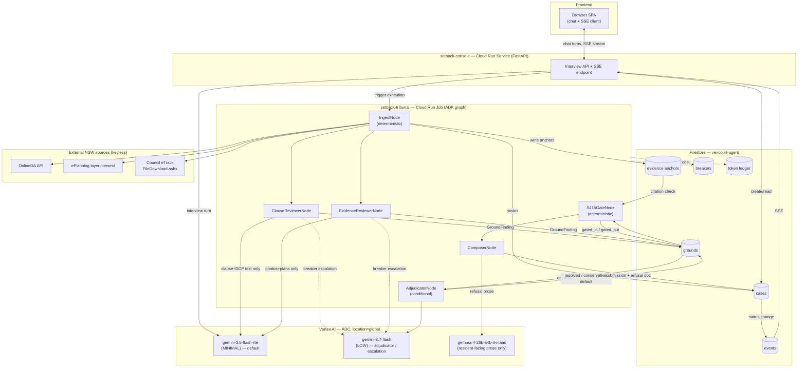

# Setback

A Collaborative Partner agent that helps NSW residents object to a
neighbouring Development Application (DA).

Built for the Google "All Things Agentic Hackathon".

## What it is

Setback interviews a resident about their concerns with a neighbouring DA,
ingests the exhibited plans and any photos the resident supplies, verifies
every factual claim against keyless NSW government zoning and planning APIs,
and runs two structurally disjoint reviewer agents plus an adjudication step
over each candidate objection ground. A deterministic citation gate then
checks every surviving ground for a resolvable source before anything is
allowed to ship. Grounds that are not planning-relevant under EP&A Act s4.15
are refused, with a plain-language explanation of why, rather than silently
dropped. The output is a submission that cites only grounds that survived
the whole pipeline.

## Architecture



Solid arrows are the main data path; dashed arrows are escalation/observability
side channels (breaker upgrades, ledger writes). See
[docs/ARCHITECTURE.md](./docs/ARCHITECTURE.md) for the full write-up (component
map, Firestore schema, failure handling, credential security, the s4.15 gate,
and the MVP cut list) — this diagram is its §9, reproduced here.

At a high level: Interview -> Ingest (OnlineDA + ePlanning spatial + council
tracker) -> Evidence dossier -> Court (Clause Reviewer / Evidence Reviewer /
adjudication bench) -> Citation gate -> Dispatch (submission + refusal
explainer).

## Local spin-up

```sh
uv sync
cp .env.example .env   # fill in local overrides; see setback/config.py for defaults
make test
make run-local
```

`make test` runs the full offline suite (480 tests) and `make run-local`
serves the console UI on `localhost:8000` with no network calls — both work
with no GCP project at all, and are enough to read the code, run the tests,
and click through the UI.

What this does **not** give you is a working tribunal: the console always
constructs its Firestore/GCS/Vertex clients against a real GCP project (there
is no emulator or offline mode for those). To run an actual end-to-end case —
interview through to a submission — you need your own GCP project with:

- APIs enabled: `run.googleapis.com`, `artifactregistry.googleapis.com`,
  `cloudbuild.googleapis.com`, `firestore.googleapis.com`,
  `secretmanager.googleapis.com`, `aiplatform.googleapis.com`
- A Firestore database and a GCS bucket for uploaded evidence
- Application Default Credentials for that project (`gcloud auth
  application-default login`)
- The environment variables in [`.env.example`](./.env.example) —
  `SETBACK_GCP_PROJECT`, `SETBACK_FIRESTORE_DB`, `SETBACK_REGION`,
  `SETBACK_GCS_BUCKET`, `SETBACK_GCS_UPLOADS_BUCKET` — pointed at that project

The author's own deployment (`vexcourt-agent`, used for the demo video and
hosted URL) is not available for judges to use directly; the steps above
recreate it against a project you control.

## Cloud spin-up

```sh
gcloud auth login
gcloud auth application-default login
export SETBACK_GCP_PROJECT=your-gcp-project-id   # a project you own
./deploy.sh
# or: make deploy
```

`deploy.sh` is idempotent: it enables the required APIs, creates the
Artifact Registry repo (once), builds and pushes the image via Cloud Build,
and deploys two Cloud Run deployables —

- `setback-console` (Cloud Run **Service**): the resident-facing FastAPI
  console, `min-instances=0`, public, session-affinity enabled.
- `setback-tribunal` (Cloud Run **Job**): the ADK court-graph pipeline, 1
  vCPU / 2GiB, 1800s task timeout, invocable only by the console's service
  account.

Expected output ends with something like:

```
>> Deploy complete.
image:             australia-southeast1-docker.pkg.dev/<project>/setback/setback:<tag>
console URL:       https://setback-console-xxxxxxxxxx-ts.a.run.app
console revision:  setback-console-00042-abc
tribunal job:      setback-tribunal (generation 7)
```

See [`deploy.sh`](./deploy.sh) for the full commented sequence (API
enablement, IAM bindings, cleanup policy) and
[docs/ARCHITECTURE.md §5](./docs/ARCHITECTURE.md) for the credential-security
model behind the two service accounts it deploys as.

## Models used

| Model | Role | Thinking level |
|---|---|---|
| `gemini-3.5-flash-lite` | Resident-facing interview | MINIMAL |
| `gemini-3.7-flash` | Adjudication bench (conflict resolution / escalation) | LOW (its effective floor) |
| `gemma-4-26b-a4b-it-maas` | Low-cost clerical extraction & refusal prose (OpenAI-compatible MaaS endpoint) | n/a |

Mandatory for all categories: 1) Gemini 3.5 or newer accessed through Gemini
API or Vertex AI.

All three models above are accessed through Vertex AI and satisfy this
requirement.

## Data sources

- NSW ePlanning OnlineDA API (CC-BY).
- NSW Planning spatial services / layerintersect (CC-BY 3.0 AU, NSW Crown Copyright, Department of Planning and Environment).
- Council eTrack / ePathway exhibited documents (statutorily public records under the EP&A Act; used here for demonstration with attribution, not redistributed as a dataset).
- Google Maps Platform imagery, where used (subject to Google Maps Platform terms, displayed with attribution).

## Hackathon disclosure

See [DISCLOSURE.md](./DISCLOSURE.md).

## License

MIT — see [LICENSE](./LICENSE).
