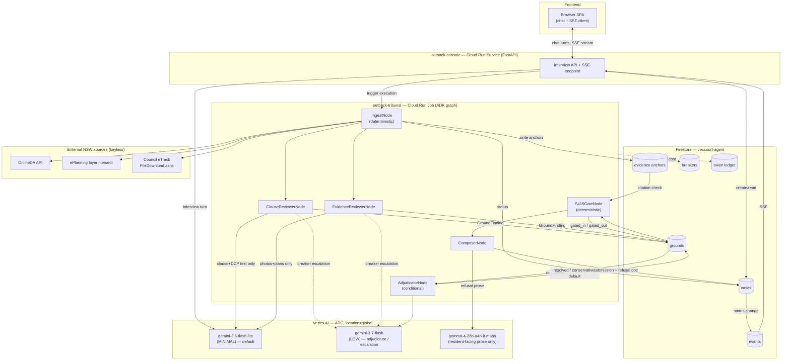

# Setback — Architecture

Google All Things Agentic Hackathon submission. GCP project `vexcourt-agent` (display
name "Setback"). Stack: Python 3.12, `google-adk==2.8.0` (graph Workflow API),
`google-genai==2.20.0` on Vertex AI (ADC, `location=global`). Models: `gemini-3.5-flash-lite`
(thinking `MINIMAL`) as the default worker tier, `gemini-3.7-flash` (thinking `LOW`) as the
adjudicator / escalation tier, `gemma-4-26b-a4b-it-maas` for non-legal prose polishing.
Storage: Firestore. Compute: Cloud Run (service + job).

This document is the spec the build executes against and the judges read. Names below
are the literal module/collection/field names the code uses — treat them as contracts,
not suggestions.

---

## 1. Component map

Three deliberately separate deployables, plus a shared library of deterministic modules
that both call into.

| Component | Type | Repo path | Talks to |
|---|---|---|---|
| `setback-console` | Cloud Run **Service** (FastAPI, ASGI, scale-to-zero) | `console/` | Firestore (`cases`, `events`), Vertex AI (interview turns only), triggers `setback-tribunal` |
| `setback-tribunal` | Cloud Run **Job** (one execution per case run) | `tribunal/` | Firestore (all collections), Vertex AI (review/adjudication/composition calls), OnlineDA / ePlanning / eTrack (via `ingest/`) |
| `ingest/` | deterministic library, no LLM calls | `shared/ingest/` | OnlineDA API, ePlanning `layerintersect`, council eTrack `FileDownload.ashx` |
| `evidence/` | deterministic library, no LLM calls | `shared/evidence/` | Firestore evidence anchors, bbox math, provenance grading |
| `llm/` | shared single-call-site client | `shared/llm/` | Vertex AI (`google-genai`), breaker/ledger state in Firestore |

**Why console and tribunal are decoupled (not one FastAPI app doing everything):**

1. **Latency shape mismatch.** The interview is interactive request/response — a resident
   typing answers, expecting sub-second turns. A full court run (ingest → two reviewers →
   possible adjudication → gate → compose) is a multi-minute, multi-model-call batch job.
   Putting both in one HTTP handler means either the interview blocks behind a Cloud Run
   request timeout, or the batch work degrades interview latency under load.
2. **Independent failure/retry domains.** The tribunal job can crash, retry, or be killed
   by Cloud Run Job's max execution time without taking the resident's chat session down
   with it. The console process is expected to be robust and long-lived per session;
   the job is expected to be disposable and retryable.
2. **Least privilege.** The tribunal job's service account needs Vertex AI review/adjudication
   scopes and outbound egress to three external NSW government hosts. The console's service
   account needs only Firestore read/write on `cases`/`events` and a narrow Vertex AI scope
   for interview chat, plus permission to start the job. Neither SA needs the other's full
   permission set (see §5).
4. **Independent scaling.** Console scales on concurrent chat sessions (cheap, bursty).
   Tribunal scales on cases-in-review (expensive, one-at-a-time is fine for MVP — see §8).

`ingest/` and `evidence/` are plain Python packages with no ADK/genai dependency, imported
by both deployables: console uses them for quick synchronous lookups during the interview
(e.g. confirming an address resolves to a real DA before starting a case); tribunal uses
them for the bulk fetch-and-anchor pass in `IngestNode`. Keeping them dependency-free and
side-effect-explicit (they take a Firestore client as an argument, never construct one
globally) is what makes them independently unit-testable without a live GCP project.

---

## 2. The ADK court graph

Defined in `tribunal/graph.py` using ADK 2.8.0's graph Workflow API. One case run = one
graph execution.

### Nodes

| Node | LLM? | Model tier | Reads | Never reads |
|---|---|---|---|---|
| `IngestNode` | no | — | OnlineDA, ePlanning, eTrack, resident photo uploads | — |
| `ClauseReviewerNode` | yes | `gemini-3.5-flash-lite` MINIMAL → escalates to `gemini-3.7-flash` LOW on breaker | LEP/DCP clause text, zoning controls (height/FSR), the s4.15(1) heads-of-consideration list | photos, plans, bounding boxes |
| `EvidenceReviewerNode` | yes | same tiers as above | resident photos, architectural plans/elevations, bbox-anchored image crops | legislation text, clause numbers, DCP text |
| `AdjudicatorNode` | yes | `gemini-3.7-flash` LOW only (never degrades further) | the **structured findings** (not raw evidence) from both reviewers, only when triggered | raw photos or raw clause text directly — it adjudicates conclusions, not source material |
| `S415GateNode` | no | — | every `GroundFinding`, the `s415_grounds` reference list, Firestore evidence/clause existence | — |
| `ComposerNode` | partial | `gemma-4-26b-a4b-it-maas` for resident-facing prose only | gated grounds, evidence anchors | — (legal content is templated, not generated) |

### Edges

```
IngestNode ──┬──> ClauseReviewerNode ───┐
             └──> EvidenceReviewerNode ─┴──> [conflict?] ──yes──> AdjudicatorNode ──> S415GateNode ──> ComposerNode
                                                  └──no───────────────────────────────────^
```

`ClauseReviewerNode` and `EvidenceReviewerNode` run **in parallel** (ADK fan-out) against
the same `IngestNode` output, then fan back in on ground identity (same `clause_ref`).
`AdjudicatorNode` is a **conditional** node: it only fires when the two reviewers'
`GroundFinding`s for the same ground disagree (one asserts non-compliance, the other is
silent or contradicts it) or either reviewer emits a confidence below threshold. If the
reviewers agree, the ground passes straight to `S415GateNode` — most grounds never touch
the adjudicator, which keeps the $/run ledger down (see §4).

### Structural disjointness — not just prompted, enforced

The "Clause Reviewer never sees photos, Evidence Reviewer never sees legislation" rule is
implemented as a **type boundary**, not a system-prompt instruction:

- `build_clause_slice(case) -> ClauseSlice` (Pydantic model: `clauses: list[ClauseText]`,
  `controls: ZoningControls`, `s415_categories: list[str]`) is the *only* function that can
  construct a `ClauseReviewerNode` input. `ClauseSlice` has no field capable of holding an
  image part.
- `build_evidence_slice(case) -> EvidenceSlice` (Pydantic model: `photos: list[ImageAnchor]`,
  `plans: list[ImageAnchor]`) is the *only* function that can construct an
  `EvidenceReviewerNode` input. `EvidenceSlice` has no field capable of holding clause text.
- A unit test (`tests/test_slice_disjointness.py`) asserts, for every fixture case, that
  serializing a `ClauseSlice` to the genai `Content` parts list never produces an
  `inline_data`/`file_data` part, and that serializing an `EvidenceSlice` never produces a
  `text` part matching a clause-number regex (`s\d+\.\d+|cl\.\s?\d+`). This is a judge-checkable
  test, not a prompting claim.

### Conservative default on unresolved split

If `AdjudicatorNode` cannot resolve a conflict with confidence above threshold (rare —
its job is specifically to resolve exactly this), the ground is marked
`status=gated_out`, `refusal_reason=low_confidence_unadjudicated`, and is **excluded**
from the submission rather than guessed at. The plain-English refusal output says so
explicitly. Setback never asserts a planning ground it isn't confident in — silence is
always the safe failure direction here, never fabrication.

---

## 3. Firestore schema

Project: `vexcourt-agent`. All collection/field names below are literal.

```
cases/{case_id}
  case_id            = slug("{council}-{da_number}")           # e.g. "georges-river-PAN-661190"
  address, council, da_number, exhibition_end
  status             ∈ {interview, ingesting, reviewing, adjudicating, gated, composed, failed, budget_exceeded}
  created_at, updated_at
  budget_used_usd, budget_ceiling_usd   # ceiling = 2.00 per run (see §4)
  ingest_complete_at (nullable)          # resume marker

cases/{case_id}/grounds/{ground_id}
  ground_id          = sha256(clause_ref + normalize(ground_text))[:16]   # deterministic
  clause_ref, category         # category ∈ s415_grounds reference list, §6
  raised_by          ∈ {clause, evidence, both}
  status             ∈ {proposed, adjudicated, gated_in, gated_out}
  rationale
  cited_evidence_ids: list[str]     # anchor_ids, checked by the gate
  refusal_reason     ∈ {null, non_planning_ground, unresolved_citation, low_confidence_unadjudicated, budget_exceeded}
  refusal_explanation (nullable, plain English)

cases/{case_id}/evidence/{anchor_id}
  anchor_id          = sha256(source_doc + page + bbox_tuple)[:16]    # deterministic
  source_doc, page, bbox: [x0, y0, x1, y1]
  provenance_grade   ∈ {A, B, C}   # A = official council doc, B = verified applicant plan, C = unverified resident photo
  extracted_text_or_caption
  fetched_at

cases/{case_id}/events/{event_id}
  event_id           = ULID()      # monotonic, sortable — drives SSE resume
  node, stage_status ∈ {started, completed, failed, degraded}
  at

cases/{case_id}/breakers/{stage}
  stage              ∈ {clause_reviewer, evidence_reviewer, adjudicator}
  fail_count, state  ∈ {closed, open, half_open}
  opened_at (nullable), degraded_model: bool

cases/{case_id}/ledger/{call_id}
  call_id            = ULID()
  model, input_tokens, output_tokens, cost_usd, stage, at

config/s415_grounds        # single doc, the deterministic legal relevance list, §6
```

**Deterministic IDs, idempotent writes.** `ground_id` and `anchor_id` are content hashes,
not auto-IDs — re-running `IngestNode` or a reviewer after a crash writes the *same*
document ID with `set(..., merge=True)`, so retries never duplicate a ground or an
evidence anchor. `event_id` and `call_id` are ULIDs (need ordering, not idempotency —
each represents a discrete occurrence, duplicates there are harmless to detect and drop
via the sweeper if they ever occur).

**Resume semantics.** On start, `setback-tribunal` reads `cases/{case_id}`. If
`ingest_complete_at` is set and the `evidence` subcollection is non-empty, `IngestNode` is
skipped and the job resumes at the reviewer fan-out. If `status` is already `gated` or
`composed`, the job exits immediately (no-op) — this makes re-triggering a job for an
already-finished case safe, which matters because the sweeper (§4) and manual retries both
re-trigger by case ID, not by run ID.

---

## 4. Failure handling

### Circuit breakers (per stage, per case)

`cases/{case_id}/breakers/{clause_reviewer|evidence_reviewer|adjudicator}`. Three
consecutive failures (HTTP 429/500, or a Pydantic schema-validation failure on the model's
structured output) within a case opens the breaker for that stage:

- If the stage was calling `gemini-3.7-flash`, it **degrades** to `gemini-3.5-flash-lite`
  and half-opens (retries once at the lower tier before re-opening).
- If the stage was already on `gemini-3.5-flash-lite` (the default), the breaker opens
  fully — the stage is forced to its conservative default (ground `gated_out`,
  `refusal_reason=low_confidence_unadjudicated`) and the case proceeds without that ground
  rather than retrying indefinitely.
- `AdjudicatorNode` never degrades further (it's already the top tier) — an open breaker
  there means every conflicted ground in that case falls to the conservative default.

### Retry/backoff on 429 (Dynamic Shared Quota)

Handled *inside* `llm/client.py`, the single call site (§7), **before** a failure counts
against the breaker: exponential backoff with jitter, base 1s, cap 30s, max 5 attempts.
Only after all 5 attempts fail does it register as one breaker failure. This separates
"quota hiccup, retry transparently" from "stage is actually unhealthy, degrade."

### What happens when a worker agent loops or hallucinates (rubric question, answered directly)

- **Loops:** every node has a hard `max_tool_calls` / `max_turns` counter enforced in
  Python state (not a prompt instruction asking the model to stop) — e.g. 4 for the
  reviewers. Hitting the counter is treated as a stage failure and increments the breaker;
  it is never silently retried past the limit. There is no code path that can call a model
  in an unbounded loop — the counter is checked before every call, in the same function
  that checks the budget ledger.
- **Hallucinates:** three independent nets, not one:
  1. **Schema validation.** Every model call requests structured output against a Pydantic
     schema; a parse failure is treated as a stage failure (feeds the breaker), not
     silently coerced.
  2. **Citation resolution** (`S415GateNode`, deterministic — §6). Any `GroundFinding`
     citing a `clause_ref` or `anchor_id` that doesn't exist in Firestore, or a bbox
     outside the source image's bounds, is auto-rejected regardless of how plausible the
     surrounding text reads. A model cannot invent a citation into existence.
  3. **Conservative adjudication default** (§2). An unresolved conflict is dropped from
     the submission, never guessed.

### Sweeper (outside the agent loop)

A separate Cloud Scheduler-triggered Cloud Run function (`sweeper/main.py`), **not** part
of the ADK graph or any node — it never calls a model. It scans `cases` for `status` stuck
in a running state (`ingesting`/`reviewing`/`adjudicating`) for longer than 10 minutes
(covers a crashed job, an OOM kill, or a Cloud Run Job hard timeout that the job process
itself never got to handle) and marks the case `failed` with an events entry, so
`setback-console`'s SSE stream terminates cleanly for the resident instead of hanging
indefinitely waiting for an event that will never arrive.

### $2/run ledger abort

Before every model call, the call site reads `cases/{case_id}.budget_used_usd` inside the
same transaction that will increment it. If the *projected* cost of the call (estimated
from tier + expected token count) would push `budget_used_usd` past the per-run ceiling of
**$2.00** (tracked separately from the hackathon-wide $62 ceiling, which is a manual
dashboard check across all cases, not an automated gate), the call is skipped, the stage
forced to its conservative default, and `cases/{case_id}.status` set to `budget_exceeded`.
This is a hard stop, not a warning — no stage can spend past it.

---

## 5. Credential security

- **ADC everywhere.** Both `setback-console` and `setback-tribunal` authenticate to Vertex
  AI and Firestore purely via Application Default Credentials (the Cloud Run service
  identity). Zero API keys appear in code, environment variables, or config for any Google
  API.
- **Service accounts, least privilege, one per deployable:**
  - `setback-console-sa`: `roles/datastore.user` (scoped in application logic to
    `cases`/`events` only — Firestore has no native per-collection IAM, so this is enforced
    in the repository layer, §7, not IAM alone), `roles/aiplatform.user` (interview chat
    calls only), `roles/run.invoker` on the `setback-tribunal` job (to trigger it). No
    external egress permission needed beyond calling the job.
  - `setback-tribunal-sa`: `roles/datastore.user` (full case subcollections),
    `roles/aiplatform.user` (review/adjudication/composition calls), outbound egress to
    `onlineda.*`, `api.apps1.nsw.gov.au`, and `etrack.georgesriver.nsw.gov.au` (no IAM
    role for this — it's network egress, not a GCP permission — but it is the only SA
    whose runtime has a reason to reach those hosts). `roles/secretmanager.secretAccessor`
    scoped to exactly the Maps secret, if and when one exists (see below).
  - Neither SA is `roles/editor` or `roles/owner`. Neither SA can read the other's scope
    it doesn't need.
- **The one API key that can exist (Maps):** if geocoding/mapping is added, the key is
  created restricted (API-restricted to Maps, and IP/referrer-restricted to the Cloud Run
  service), stored in Secret Manager on project `vexcourt-agent` under a secret named
  `setback-maps-key`, and referenced by `setback-tribunal`/`setback-console` at deploy time
  via `--set-secrets MAPS_API_KEY=setback-maps-key:latest` — never inlined in code, never
  printed in logs, never committed. Nothing in this MVP currently requires it (zoning is
  resolved via the ePlanning `layerintersect` API directly, not a rendered map — see §8),
  so as of this design it does not exist yet.

---

## 6. The deterministic s4.15 gate

`S415GateNode` is pure Python — no model call, fully unit-testable, fully auditable by a
judge reading the code in under a minute.

### The legal relevance list, as data

`config/s415_grounds` (a single Firestore doc, mirrored from `shared/s415_grounds.yaml` at
deploy time so it's both version-controlled and runtime-checkable) enumerates the EP&A Act
s4.15(1) heads of consideration as category codes:

```yaml
- code: a_planning_instruments     # s4.15(1)(a) — LEPs / environmental planning instruments
- code: a1_draft_instruments       # s4.15(1)(a1)
- code: b_dcp                      # s4.15(1)(b) — development control plans
- code: c_impacts                  # s4.15(1)(c) — natural/built/social/economic impacts
- code: d_site_suitability         # s4.15(1)(d)
- code: e_submissions              # s4.15(1)(e) — public submissions
- code: f_public_interest          # s4.15(1)(f)
```

Every `GroundFinding` a reviewer produces must be tagged with exactly one `category` from
this list. `is_planning_relevant(category) -> bool` is a pure lookup against this list —
not a model judgment call. A ground whose category isn't on the list (or whose category
tag is missing/malformed) is rejected with `refusal_reason=non_planning_ground` before
anything else is checked. This is what stops Setback from ever forwarding a "the new
owners seem unfriendly" or "I don't like their car" style objection into a formal
submission — it's structurally impossible, not just discouraged by prompting.

### Citation resolution

For every `cited_evidence_id`/`clause_ref` on a ground, the gate checks:

1. The document/anchor actually exists in `cases/{case_id}/evidence/{anchor_id}` (for
   evidence) or matches a known clause number pattern actually present in the ingested
   LEP/DCP text (for clause refs) — not just pattern-shaped, actually resolvable back to
   ingested content.
2. For evidence anchors specifically: the bbox falls within the source image's actual
   pixel bounds (guards against a coordinate hallucination that happens to look valid).

Any failure here rejects the ground with `refusal_reason=unresolved_citation`, regardless
of how confident or well-written the surrounding rationale text is.

### Refusal semantics

A rejected ground is never silently dropped — it's written to Firestore with
`status=gated_out`, a `refusal_reason` enum value, and a `refusal_explanation` string.
`ComposerNode`'s `PlainEnglishRefusalAdapter` (§7) surfaces every rejected ground verbatim
in the "what I refused and why" section of the output, so the resident sees exactly what
Setback declined to include and why — this is a product feature (trust/transparency), not
just an internal log.

---

## 7. Design patterns actually used, and why

Written so a judge scoring "clean, modularized, maintainable" finds the answer fast.

- **Single model call site** (`shared/llm/client.py`, one function: `call(model, contents,
  tier, case_id, stage) -> StructuredResponse`). Every one of the ~5 places in the graph
  that talks to a model goes through this one function. Retry/backoff, ledger writes, and
  breaker checks live here exactly once — there is no second place in the codebase that
  could construct a genai request that skips metering or budget enforcement.
- **Ports & adapters for output composition** (`shared/compose/`). `ComposerPort` is an
  interface consumed by `ComposerNode`; `CouncilSubmissionAdapter` produces the formal
  council-format document, `PlainEnglishRefusalAdapter` produces the resident-facing
  refusal summary. Both consume the same gated `Ground`/`Evidence` domain objects with no
  duplicated logic. Adding a third output (e.g. a PDF export adapter) later is a new class
  implementing the port, not a graph change.
- **Evidence provenance grading as a value object** (`ProvenanceGrade: Literal["A","B","C"]`
  attached at ingest time, in `IngestNode`, and never re-derived downstream). "How much do
  we trust this fact" has exactly one place it's decided — the deterministic ingest
  boundary — and flows unchanged through reviewers, the gate, and the composer. No LLM
  node ever re-grades evidence trust.
- **Repository pattern for Firestore** (`CaseRepo`, `GroundRepo`, `EvidenceRepo` in
  `shared/repo/`). Deterministic-ID generation and idempotent `merge=True` writes live in
  one place per collection; node code never imports the Firestore SDK directly, it calls
  `GroundRepo.upsert(ground)`. This is what makes the resume semantics (§3) testable
  without a live Firestore emulator running for every node's unit tests.
- **Strategy pattern for model tier selection** (`shared/llm/tier.py`:
  `select_tier(stage, breaker_state) -> ModelTier`). Breaker state decides
  `gemini-3.7-flash` vs `gemini-3.5-flash-lite` without any node's logic branching on it —
  a node just calls `llm.call(...)` and the tier is resolved for it.

---

## 8. MVP cut list (deliberately not built)

| Cut | One-line reason |
|---|---|
| Multi-council genericization | One demo case (Georges River), 74h window — `ingest/` adapters are hardcoded to eTrack/ePlanning's actual response shapes, not a general council plugin system. |
| User auth / multi-tenant login | Single-session-per-case-link is enough for a hackathon demo; no resident PII protection surface to build auth around yet. |
| PDF rendering of the final submission | Output is formatted Markdown/HTML matching the council's submission fields — a PDF adds a rendering dependency with zero judging upside. |
| Live map / Maps-key-backed UI | Zoning is already resolved via the ePlanning `layerintersect` API without needing a rendered map; the Maps key path in §5 exists as a documented contingency, not a built feature. |
| Cloud Run Job concurrency / autoscaling tuning | Demo processes one case at a time; not a cost or latency concern inside the hackathon window. |
| Firestore security rules per resident user | No auth system to hang per-user rules off yet; service-level IAM is the only access boundary in MVP. |
| Dead-letter queue / retry-forever infra | The sweeper (§4) plus per-stage breakers cover every failure mode the demo can hit without extra queueing infrastructure. |
| Token-by-token streamed model output to the frontend | SSE streams stage-*completion* events, not token deltas — a reviewer's full structured JSON is more useful mid-stream than partial tokens, and far simpler to implement reliably under a deadline. |

---

## 9. Architecture diagram



Solid arrows are the main data path; dashed arrows are escalation/observability side
channels (breaker upgrades, ledger writes).
